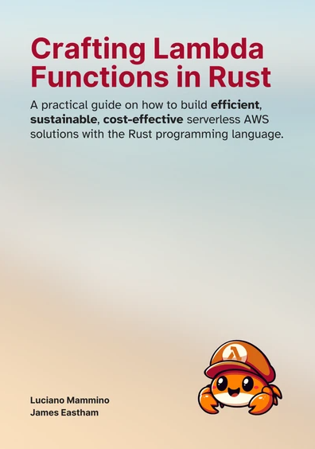

# Code samples for the book "Crafting Lambda Functions in Rust"

This repository contains the code samples for the book "Crafting Lambda
Functions in Rust" by Luciano Mammino and James Eastham.

You can get a copy of this book on [rust-lambda.com](https://rust-lambda.com).

## Code organization

The various examples are organized in different folders, each one containing the
code related to a specific chapter of the book.

## Requirements

To run the examples in this repository you will need to have:

- Rust installed on your machine (you can get it from
  [rustup.rs](https://rustup.rs))
- An AWS account
- The [AWS CLI](https://aws.amazon.com/cli/) installed and configured with your
  AWS credentials
- [`cargo-lambda`](https://www.cargo-lambda.info/)
- [Docker](https://www.docker.com/) installed on your machine
- The [SAM CLI](https://aws.amazon.com/serverless/sam/) installed on your
  machine

## Do you need help?

You can join the [official Discord server](https://discord.gg/jXF5VSHMDW) to
chat about the book and the code examples.

## Did you find a bug or want to suggest an improvement?

Please open an issue on this repository or submit a pull request.
